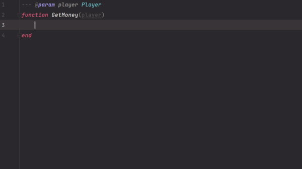

# Core Games API - Unofficial Lua Types

## WIP Disclaimer

This project is still a work in progress and need some improvements :

- [x] Use the [CoreGameAPI.json](https://docs.coregames.com/assets/api/CoreLuaAPI.json) file
- [x] Change output file `core-games-api.def.lua` (currently using the one on Github)
- [x] Implements global `script` (not defined in CoreGameAPI)
- [x] Generate file structure with full implementation
  - [x] Namespaces
  - [x] Classes
  - [x] Enums
  - [x] Inheritance
- [ ] Better Event Type with use of Generics
- [x] Optional function parameters
- [ ] Create daily release system
- [ ] Provide a better documentation
- [x] Improve code structure

## Why ?

When working on Lua with Core Games, even with the referenced plugins for VSCode it does not provide a good type checking.
Type checking provide a good flexible autocomplete system and give you errors when you are trying to access undefined properties.

### Without Types


### With Types



## Install

As the types are just from a simple Lua file it can be understand in any IDE, VSCode, Jetbrains, etc.
I still encourage to use IntelliJ IDEA, it provides stronger understanding of types.

### VSCode

#### 1. Install vscode-core

Get the official [vscode-core](https://marketplace.visualstudio.com/items?itemName=ManticoreGames.vscode-core) extension which is based on the config file generated here.

### IntelliJ IDEA (or PhpStorm, Webstorm, etc)

#### 1. Install EmmyLua

In order to enjoy the power of [LDoc](https://stevedonovan.github.io/ldoc/manual/doc.md.html) you must use a plugin that understand it.

For that, install the [Luanalysis plugin for Jetbrains](https://plugins.jetbrains.com/plugin/14698-luanalysis)

#### 2. Open your project with Jetbrains

First, you must retrieve the location of your project.
For that Right Click on a script in the Core Editor Project Content, click on `Show in explorer` and copy the link of the directory.

Then open Jetbrains and click on `File > Open...` and paste the path of your scripts folder.

#### 3. Add the definition file to your project

In Core Editor, create a new Script called `CoreGamesAPI` and delete it from the hierarchy.
Open the Script in VSCode and paste the content of [core-games-api.def.lua](core-games-api.def.lua) in it.

Done! You can now code and have full autocomplete for the CoreGamesAPI and also for your own Scripts!

## How

Whenever you code, typing what you write is always a good thing. For you, and for the others.

### Functions

By typing your function parameters, you will be able to have full autocompletion inside your functions.
And by typing the return, you will be able to call this function anywhere in your application and still enjoying the autocomplete and the type checking.

```lua
--- @param player Player
--- @return number
function GetMoney(player)
    return player:GetResource("money")
end
```

### Locals

By typing your locals you will be able to enjoy autocomplete and type checking even on your custom properties !

```lua
--- @type number
local customProperty = script.parent:GetCustomProperty("customProperty")

--- @type ScriptAsset
local myScript = script.parent:GetCustomProperty("myScript")
```

### Classes

You create your own types by adding LDoc to your classes.

```lua
--- @class MyClass
MyClass = {}

return MyClass
```

Now you can use this type to enjoy autocompletion on your own modules.

```lua
local propMyScript = script.parent:GetCustomProperty("myScript")

--- @type MyClass
local MyClass = require(propMyScript)
```
